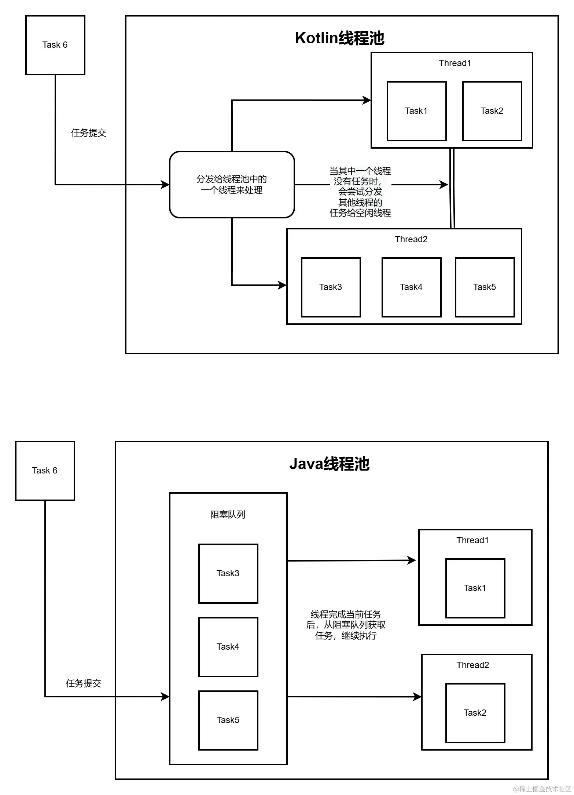
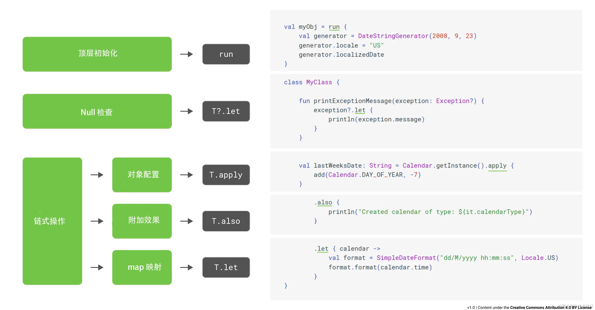

协程本质是线程池的Task


kotlin 里没有静态变量和静态方法，在kotlin中通过 @JvmStatic 注解修饰才实现。需要注意，只有在object 或者 companion object 中才能使用 @JvmStatic注解

如果要表示不可变的量，需要通过 const val 来修饰的。const 只能修饰没有自定义 getter 的 val 属性，而且它的值必须在编译时确定，而且 const 只能在单例或者伴生对象中使用

//由var修饰，会生成 set 和 get 方法
var name: String = ""

//由val修饰，会生成 get 方法，不会生成set方法
val name: String = "xxxx"

//private修饰，无论由val还是var修饰，默认不会生成set、get方法
private var name: String = ""

kotlin 中的内部类默认是静态内部类，如果需要声明普通内部类，需要加上 inner 关键字

嵌套单例，是 object 单例的一种特殊情况；伴生对象，是嵌套单例的一种特殊情况。


通过伴生对象 Double Check 来创建单例
```
class A private constructor(val name: String, val id: String) {

    companion object {

        @Volatile
        private var INSTANCE: A? = null

        fun getInstance(name: String, id: String): A {
            return INSTANCE ?: synchronized(this) {
                INSTANCE ?: A(name, id).also { INSTANCE = it }
            }
        }

    }
}
```


//为了减少代码重复，我们可以定义抽象模板, 这样就可以方便的实现 double check 创建单例了

```
abstract class BaseDoubleCheckSingleton<in T, out V> {

    @Volatile
    private var INSTANCE: V? = null

    abstract fun creator(param: T): V

    fun getInstance(param: T): V {
        return INSTANCE ?: synchronized(this) {
            INSTANCE ?: creator(param).also { INSTANCE = it }
        }
    }

}

class B private constructor(param: String) {
//实现模板类
    companion object: BaseDoubleCheckSingleton<String, B>() {
        override fun creator(param: String): B = B(param)
    }
}
//获取单例
B.getInstance("test")
```


密封类是更强大的枚举类


kotlin 的协程其实是 kotlin 线程池中的一个任务（Task）




提供了 launch 、async、runBlocking 三个方法来创建协程， launch 、async是 CoroutineScope的扩展方法，它们的区别是，async 可以获取协程执行的结果，
而 launch 不行。runBlocking 则是一个顶层方法，它可以获取协程的执行结果，但这种方式会阻塞代码的执行流程，因此只建议在测试中使用

```
public fun CoroutineScope.launch(
    context: CoroutineContext = EmptyCoroutineContext,
    start: CoroutineStart = CoroutineStart.DEFAULT,
    block: suspend CoroutineScope.() -> Unit
): Job
```


CoroutineScope 是协程的作用域，主要作用是用来追踪协程的。把协程看作任务的话，CoroutineScope 其实就是 TaskManager，负责管理所有通过它创建的协程。上面的代码示例中，GlobalScope 就是 CoroutineScope 的一个子类，表示的是全局作用域。需要注意：所有协程都需要通过 CoroutineScope 来启动。
CoroutineContext 是指协程的上下文。不同于 Android 中 Context，CoroutineContext 的功能更像一个 Map，它内部包含多种类型的元素。
CoroutineStart 是指协程的启动选项，有DEFAULT、LAZY、ATOMIC、UNDISPATCHED四种。DEFAULT 是默认的选项，指创建协程后立即启动；而LAZY 则是延迟启动。另外两个则使用得比较少
block 是指带接收者的挂起函数（Function with Receiver），是 kotlin 的语法糖，它其实等同于suspend CoroutineScope(self: CoroutineScope) -> Unit。这里重要的不是语法糖，而是 suspend ，它表明该函数是挂起函数。


其实说挂起和恢复比较难理解，其实简单的说挂起就是协程任务从当前线程脱离，恢复则是协程任务回到了原线程


CoroutineContext 的功能类似一个 Map，它内部包含多种类型的元素。其核心功能就是内部的元素实现的。CoroutineContext 中最常用的有四种元素，分别是：

Job：可以监测并操控协程
CoroutineName：协程的名称，一般用于调试
CoroutineDispatcher：用于将协程任务分发到要求的线程上
CoroutineExceptionHandler：处理未捕获的异常


Job 可以监测并操控协程，可以说是协程的句柄。Job的获取有三种方式，分别是通过 CoroutineContext 获取、通过 launch、async 的返回值获取

```
//通过 CoroutineContext 获取
coroutineContext.job //等同于 coroutineContext[Job]

//通过 launch 返回值获取
val job:Job = scope.launch {
...
}

//通过 async 返回值获取。Deferred 是 Job 的子类
//相比 Job 多了 await 方法来获取协程的返回值
val deferred: Deferred = scope.async {
...
}


job.isActive  //是否活跃
job.isCancelled //是否被取消
job.isCompleted //是否执行完成
job.invokeOnCompletion { //协程执行完后回调

}

job.start()  //启动协程，一般用作 CoroutineStart.LAZY 懒加载模式下启动协程
job.cancel() //取消协程
job.join()   //阻塞等待直到此 Job 结束运行
deferred.await() //阻塞等待直到获取协程的执行结果


val parentJob = GlobalScope.launch {//父协程

    val job1 = launch { // 子协程1  

    }  

    val job2 = launch { //子协程2  

    }  

}

parentJob.join() //会等待所有子协程执行完毕
parentJob.cancel() //会取消所有子协程
```


CoroutineDispatcher 用于将协程任务分发到要求的线程上。Kotlin 协程框架提供了四个 Dispatcher 用于指定在哪一类线程中执行协程。

Dispatchers.Default，默认调度器，它是用于 CPU 密集型任务的线程池。一般来说，它内部的线程
个数是与机器 CPU 核心数量保持一致的，不过它有一个最小限制 2
Dispatchers.IO，它是用于 IO 密集型任务的线程池。它内部的线程数量一般会更多一些
Dispatchers.Unconfined，对执行协程的线程不做限制，可以直接在当前调度器所在线程上执行
Dispatchers.Main，在Android中，表示UI线程

还可以使用 newSingleThreadContext 新创建一个线程来执行协程的调度，或者自定义一个 Java 线程池来执行协程调度

//使用 newSingleThreadContext 新建一个线程
GlobalScope.launch(newSingleThreadContext("name")) {

    }

//使用Java中的线程池
GlobalScope.launch(Executors.newCachedThreadPool().asCoroutineDispatcher()) {

}


```
CoroutineExceptionHandler 用来处理未捕获的异常
val handle = CoroutineExceptionHandler { coroutineContext, throwable ->  
    println("处理异常")
}
GlobalScope.launch(handle) {
    throw NullPointerException()
}
使用 CoroutineExceptionHandler 处理复杂结构的协程异常时，它仅在顶层协程中起作用。

由于协程的本质是线程池的任务，并且协程本身是结构化的

```

如果你了解过 java 中的 interrupt 方法，理解 cancel 和 CancellationException 就简单了。其实 cancel 和 interrupt 一样对于协程的取消需要内部的配合

```
val job = launch(Dispatchers.Default) {
    var i = 0
    while (isActive) {
        Thread.sleep(500L)
        i ++
        println("i = $i")
    }
}
delay(2000L)
job.cancel()
```

当我们调用 job.cancel 方法时，isActive 会变为 false，这样协程里面的程序才会退出。至于为什么协程提供的挂起函数，像delay，可以自动响应协程的取消呢？
这是因为它们会自动检测当前协程是否已经被取消了，如果已经被取消了，就会抛出 CancellationException 异常，从而终止当前的协程。


之前讲过协程存在父子结构。由于协程的这个特点，导致了一个协程的异常会影响到其他所有的协程。如下图所示，当子协程1发生异常时，它会先会传递给父协程，再从父协程传播到子协程2和3

如果想要子协程1发生异常时，不影响其他的协程，可以使用 SupervisorJob

```
val parentJob = Job()
GlobalScope.launch(parentJob) {
    val job1 = launch(SupervisorJob(parentJob)) {
        1 / 0
        println("job1 over")
    }

    val job2 = launch {
        delay(1000)
        println("job2 over")
    }

    val job3 = launch {
        delay(1500)
        println("job3 over")
    }
}

```

当协程1抛出异常时，协程2和协程3都能正常打印。这里需要注意的是使用 SupervisorJob(parentJob)，而不要使用 SupervisorJob()。这是为了确保协程1和 parentJob 还是父子关系。
如果使用了SupervisorJob()，协程1和 parentJob 就不是父子结构了，这时虽然协程1抛出异常，由于不是父子关系了就不会影响其他协程，但是同时parentJob.cancel 和 join方法也无法影响到协程1了


let、 run、 with、 apply、 以及 also 这五个函数。它们的作用就是在对象的上下文中执行代码块。


可以看到这些函数基本上都执行同样的操作，即在一个对象上执行一个代码块。不同的是这个对象在代码块中如何使用，以及整个表达式的结果是什么。


linux下多线程文件操作的坑
有一块业务之前的代码逻辑大概是： 图片下载以后会在kotlin中的协程中 对这个图片进行一系列的读写操作，但是因为业务逻辑会在 bindViewHolder 中进行处理，所以这个流程会在短时间内执行多次
线上有用户反馈 这个业务逻辑的图片有时候会加载不出来，有时候加载处理这个图片只能展示一部分（这个最奇怪）

在 linux 中，一个进程内，如果有多个线程打开了同一个文件文件，那么只要有一个线程持有的 FD 做了 close 操作，那么其他线程的文件操作 都会失败
实际上很多 app 都有类似的问题，比如 sqlite 文件锁 失败以后就会导致 sqlite 的崩溃， 很多 app 的 sqlite 文件锁失败的原因 都是  app 在启动的时候做了文件扫描，扫描到 sqlite 文件锁的文件之后 close
从而导致 sqlite 整个文件锁机制失效


java.lang.RuntimeException: android.os.TransactionTooLargeException: data parcel size
通常人们会认为这是比较简单的 bundle 传值导致的异常，而实际上排查下来 我们并没有出现过直接用 bundle 传递大数据的情况
所以真相只可能是 onSaveInstanceState 这个方法执行的过程 间接的保存了 bundle 导致的问题

最终的解决方案也比较简单，就是在onSaveInstanceState方法中 判断下 bundle 是否超过警戒值，超过了就 clear 不走状态保存
```kotlin
val bundleSize = BundleUtils.sizeAsParcel(outState)
if (bundleSize >= MAX_BUNDLE_SIZE) {
    // 清空数据
    outState.clear()
} else {
}

object BundleUtils {
    /**
     *
     *  @return bundle的大小 单位是byte
     */
    fun sizeAsParcel(bundle: Bundle): Int {
        val parcel = Parcel.obtain()
        try {
            parcel.writeBundle(bundle)
            return parcel.dataSize()
        } finally {
            parcel.recycle()
        }
    }
}

```


implementation("androidx.core:core-ktx:1.10.1")

```kotlin
// 更新View的可见性
view.isVisible = false 
view.isInvisible = false  
view.isGone = false

// 更新间距
view.updatePadding(left = 0, top = 0, right = 0, bottom = 0)
view.updateLayoutParams<LinearLayout.LayoutParams> {  
    width = 0  
    height = 0  
    gravity = Gravity.CENTER_HORIZONTAL  
}


val spannedString = buildSpannedString {
    bold {
        append("这是加粗文本")
    }
    color(Color.RED) {
        append("这是红色文本")
    }
    underline {
        append("这是下划线文本")
    }
    backgroundColor(Color.YELLOW) {
        append("这是黄色背景文本")
    }
    italic {
        append("这是斜体文本")
    }
    scale(1.5F) {
        append("这是放大1.5倍的文本")
    }
    strikeThrough {
        append("这是删除线文本")
    }
    subscript {
        append("这是下标")
    }
    superscript {
        append("这是上标")
    }
}
```


在Kotlin中，在有默认参数值的方法中使用 @JvmOverloads 注解，就可以很方便地实现多个重载方法。最常使用的地方就是自定义 View
```kotlin
class MyView @JvmOverloads constructor(context:Context, 
                                       attributeSet: AttributeSet? = null, 
                                       defStyleAttr: Int = 0): View(context, attributeSet, defStyleAttr) {
}


```

使用 runCatching 取代 java 风格的 try-catch
```kotlin
runCatching {
    // 执行一段可能异常的代码
}.onSuccess { 
    // 执行成功
}.onFailure {
    // 发生异常
}

```