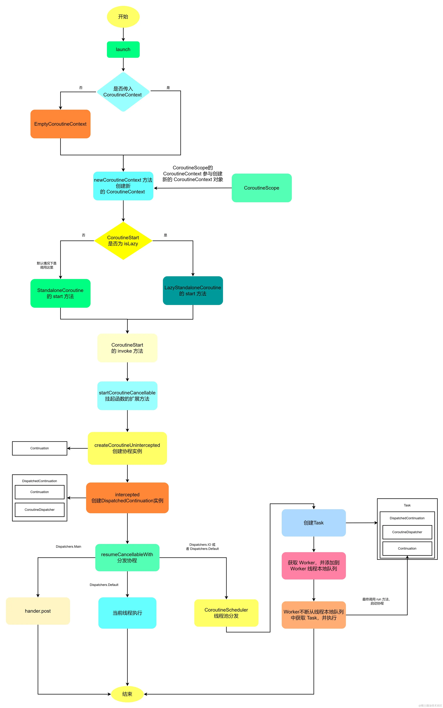

协程本质是线程池的Task

kotlin 里没有静态变量和静态方法，在kotlin中通过 @JvmStatic 注解修饰才实现。需要注意，只有在object 或者 companion object 中才能使用 @JvmStatic注解

如果要表示不可变的量，需要通过 const val 来修饰的。const 只能修饰没有自定义 getter 的 val 属性，而且它的值必须在编译时确定，而且 const 只能在单例或者伴生对象中使用

//由var修饰，会生成 set 和 get 方法
var name: String = ""

//由val修饰，会生成 get 方法，不会生成set方法
val name: String = "xxxx"

//private修饰，无论由val还是var修饰，默认不会生成set、get方法
private var name: String = ""

kotlin 中的内部类默认是静态内部类，如果需要声明普通内部类，需要加上 inner 关键字

嵌套单例，是 object 单例的一种特殊情况；伴生对象，是嵌套单例的一种特殊情况。

通过伴生对象 Double Check 来创建单例
class A private constructor(val name: String, val id: String) {

    companion object {

        @Volatile
        private var INSTANCE: A? = null

        fun getInstance(name: String, id: String): A {
            return INSTANCE ?: synchronized(this) {
                INSTANCE ?: A(name, id).also { INSTANCE = it }
            }
        }

    }

}

//为了减少代码重复，我们可以定义抽象模板, 这样就可以方便的实现 double check 创建单例了
abstract class BaseDoubleCheckSingleton<in T, out V> {

    @Volatile
    private var INSTANCE: V? = null

    abstract fun creator(param: T): V

    fun getInstance(param: T): V {
        return INSTANCE ?: synchronized(this) {
            INSTANCE ?: creator(param).also { INSTANCE = it }
        }
    }

}

class B private constructor(param: String) {
//实现模板类
companion object: BaseDoubleCheckSingleton<String, B>() {
override fun creator(param: String): B = B(param)
}

}
//获取单例
B.getInstance("test")

密封类是更强大的枚举类

kotlin 的协程其实是 kotlin 线程池中的一个任务（Task）

